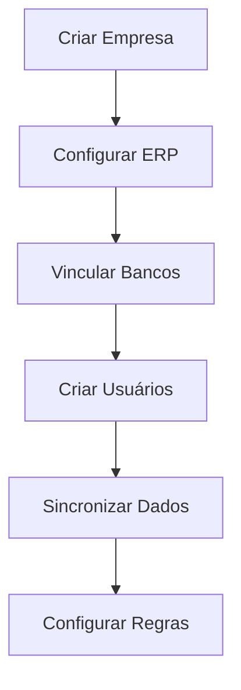

```markdown
---
# 🏦 **Sistema "Meus Bancos"** 
### *Plataforma de Gestão Financeira Corporativa*

---

## 🎯 **Visão Geral**

O **"Meus Bancos"** é uma solução completa de gestão financeira corporativa que unifica operações bancárias, integração com ERPs e processos financeiros em uma única plataforma.

### 🚀 **Capacidades Principais**
| Área | Funcionalidades |
|------|----------------|
| **🏛️ Integração Bancária** | Múltiplos bancos • Extratos • Saldos • Boletos |
| **💸 Processamento** | Pagamentos • Tributos • Conciliação • Lotes |
| **🔗 Conectividade** | Winthor • Protheus • Sankya • APIs REST |
| **🔐 Segurança** | AWS Cognito • MFA • Certificados digitais |
| **⚡ Performance** | SQS • Processamento assíncrono • Filas FIFO |

---

## 🧩 **Arquitetura do Ecossistema**

### 🔷 **AB Server MyBanks**
**🎯 Função**: *Gateway Unificado para Bancos*

```ascii
┌─────────────────┐
│   AB Server     │
│   MyBanks       │◄── Bancos (BB, Santander,
└─────────────────┘    Bradesco, Itaú, Sicoob)
         │
         ▼
├─ 📋 Boletos (/bankslip)
├─ 📊 Extratos (/statement)
├─ 💰 Pagamentos (/batch-payment)
└─ 🏛️ Tributos (/tax-revenues)
```

**🔧 Características Técnicas:**
- ✅ Padrão Strategy para múltiplos bancos
- ✅ Headers personalizáveis (`x-is-sandbox`)
- ✅ API REST unificada
- ✅ Tratamento de erros padronizado

### 🔷 **AB Worker MyBanks**
**🎯 Função**: *Orquestrador de Processos*

```ascii
┌─────────────────┐    ┌─────────────────┐
│   SQS Queue     │───▶│   AB Worker     │
│   (Jobs)        │    │   MyBanks       │
└─────────────────┘    └─────────────────┘
                              │
         ┌────────────────────┼────────────────────┐
         ▼                    ▼                    ▼
    🗃️ Sincronização     💳 Faturamento       🔗 Integração
       Saldos/Extratos      (BillingJob)         ERP
```

**🛠️ Processos Gerenciados:**
- 🔄 Sincronização de dados bancários
- 📦 Jobs de faturamento
- 🏛️ Pagamento de tributos
- 👥 Gestão de usuários e empresas

### 🔷 **AB Connector MyBanks**
**🎯 Função**: *Bridge para Sistemas ERP*

**📦 Ordem de Sincronização:**


**⚡ Otimizações:**
- 🗂️ Chunking inteligente (10/100 registros)
- 🔄 Filas FIFO para ordenação
- ✅ Validação de conexão prévia

---

## 💼 **Regras de Negócio Detalhadas**

### 🔐 **Segurança e Acesso**
| Tipo de Usuário | Permissões | Autenticação |
|-----------------|------------|--------------|
| **Portal Users** | Empresas • Filiais • Dados corporativos | Cognito + MFA opcional |
| **Admin Users** | Sistema completo • Configurações globais | Cognito + Aprovação |

### 🏢 **Gestão Empresarial**
```yaml
empresa:
  - hierarquia: "matriz → filiais"
  - configuracoes:
      - erp: "tipo, credenciais, endpoints"
      - bancos: "contas vinculadas"
      - usuarios: "perfis granulares"
  - status: "erpIntegrationActive"
```

### ⏰ **Sincronização Automática**
- **🕕 Horário**: Segunda a Sábado, 6h
- **📊 Dados**: Saldos + Extratos
- **🔗 Conciliação**: Automática com regras configuráveis

### 💳 **Processamento Financeiro**
**🎯 Fluxo de Pagamentos:**
```ascii
ERP → Validação → Agendamento → Banco → Confirmação → ERP
```

**📋 Tributos Suportados:**
- 🏛️ ISS • ICMS • PIS • COFINS
- 📄 DARF automático
- 🔄 Retorno processado

---

## 🔄 **Fluxos de Negócio**

### 🏢 **Integração de Nova Empresa**


### 💸 **Processamento de Pagamento**
1. **📥 Entrada**: Lançamento no ERP → Connector
2. **⚙️ Processamento**: Worker gerencia agendamento
3. **🏦 Execução**: Server comunica com banco
4. **🔄 Retorno**: Processamento automático
5. **✅ Confirmação**: Status atualizado no ERP

### 📊 **Conciliação Diária**
```ascii
┌─────────────────┐    ┌─────────────────┐    ┌─────────────────┐
│  Sincronização  │    │   Matching      │    │  Conciliação    │
│   Automática    │───▶│   Automático    │───▶│   Automática    │
│    (6h)         │    │                 │    │                 │
└─────────────────┘    └─────────────────┘    └─────────────────┘
                              │
                              ▼
                    ┌─────────────────┐
                    │  Relatório de   │
                    │   Exceções      │
                    └─────────────────┘
```

---

## 🛡️ **Framework de Segurança**

### 🔒 **Camadas de Proteção**
```ascii
┌─────────────────┐
│   Certificados  │←── AWS Secrets Manager
│   Digitais      │
└─────────────────┘
         │
┌─────────────────┐
│   OAuth2        │←── Tokens de Banco
│   Tokens        │
└─────────────────┘
         │
┌─────────────────┐
│   SSL/TLS       │←── Conexões Criptografadas
│   Encryption    │
└─────────────────┘
```

### ⚙️ **Controles Adicionais**
- 🕐 Timeout configurável
- 🚦 Rate limiting
- 📊 Monitoramento contínuo

---

## 📈 **Monitoramento & Qualidade**

### 🎯 **Métricas Principais**
```dashboard
┌─────────────────┬─────────────────┬─────────────────┐
│   Health        │   Performance   │   Business      │
│   Checks        │   Metrics       │   Metrics       │
├─────────────────┼─────────────────┼─────────────────┤
│ ✅ Serviços     │ ⏱️ Response     │ 💰 Transações   │
│ ✅ Conexões     │ 📊 Throughput   │ 🔄 Conciliações │
│ ✅ Bancos       │ 🚨 Errors       │ 🏛️ Tributos     │
└─────────────────┴─────────────────┴─────────────────┘
```

### 🔔 **Sistema de Alertas**
- 📧 Notificações por email
- 🔴 Dashboard em tempo real
- 📱 WebSockets para updates

---

## 🚀 **Fluxo de Dados Entre Componentes**

```ascii
┌─────────┐    ┌─────────────┐    ┌─────────┐    ┌─────────┐    ┌─────────┐
│   ERP   │───▶│  Connector  │───▶│   SQS   │───▶│  Worker │───▶│  Server │───▶│ Bancos │
└─────────┘    └─────────────┘    └─────────┘    └─────────┘    └─────────┘
                     │                 │              │              │
                     ▼                 ▼              ▼              ▼
               ┌─────────┐       ┌─────────┐    ┌─────────┐    ┌─────────┐
               │  Logs   │       │Process  │    │ Status  │    │Response │
               └─────────┘       └─────────┘    └─────────┘    └─────────┘
```

**🔍 Detalhamento do Fluxo:**
1. **📥 Coleta**: Connector extrai dados do ERP
2. **🔄 Fila**: SQS garante ordem e durabilidade
3. **⚙️ Processamento**: Worker orquestra operações
4. **🏦 Execução**: Server comunica com bancos
5. **📤 Retorno**: Status atualizado em todos os sistemas

---

## 💎 **Diferenciais Competitivos**

### 🏆 **Vantagens Exclusivas**
| Diferencial | Benefício |
|-------------|-----------|
| **🎯 API Unificada** | Interface única para todos os bancos |
| **🧠 Orquestração Inteligente** | Processamento na ordem correta |
| **🤖 Conciliação Automática** | Matching inteligente de transações |
| **📈 Escalabilidade Enterprise** | Arquitetura baseada em eventos |
| **🔒 Segurança Corporativa** | AWS Cognito + Certificados |
| **🔄 Flexibilidade ERP** | Múltiplos sistemas suportados |

### 🚀 **Valor para o Negócio**
- ⏱️ **Redução de tempo** em processos manuais
- 💰 **Otimização** de recursos financeiros
- 🔒 **Conformidade** com regulamentações
- 📊 **Visibilidade** completa do fluxo financeiro
- ⚡ **Agilidade** na tomada de decisões

---

